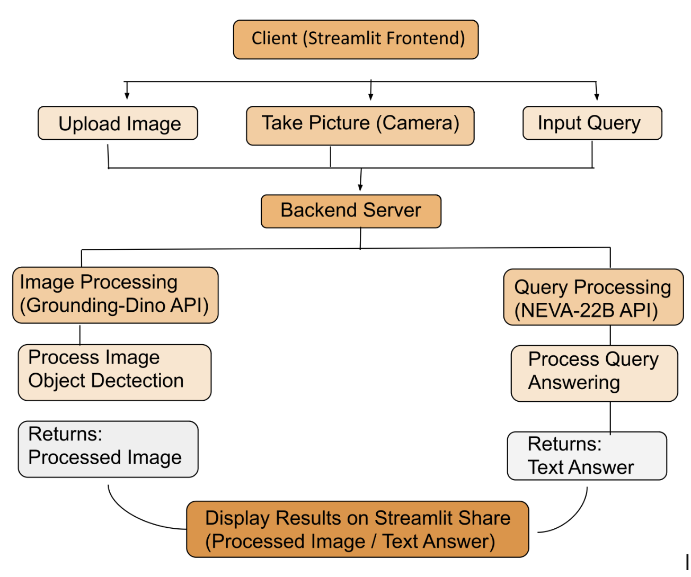
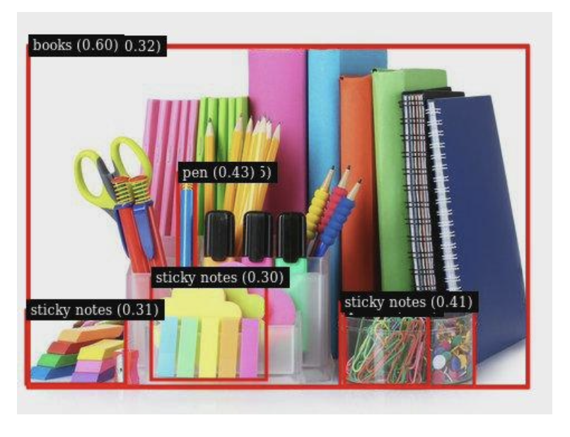
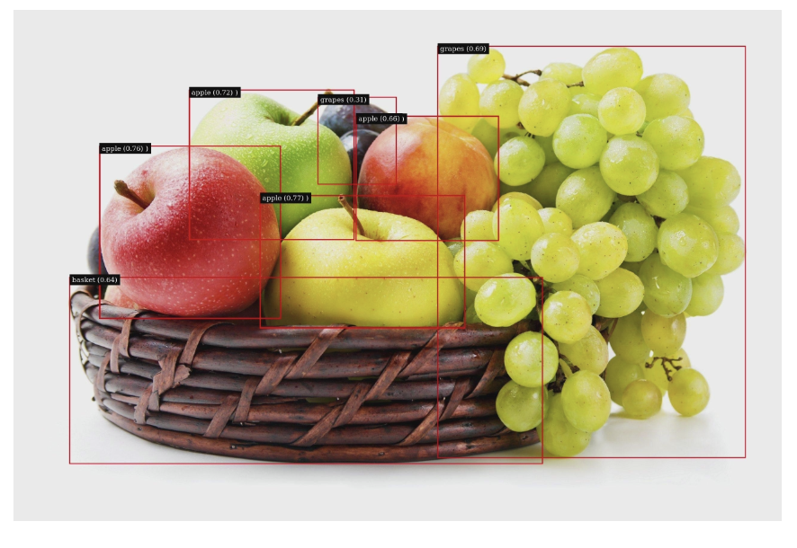
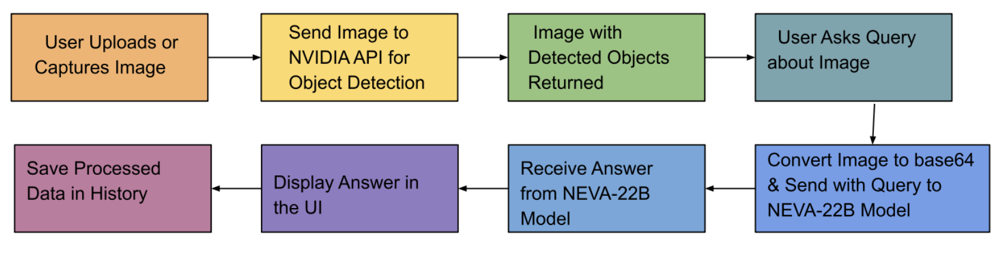

# NVIDIA Vision Assistant: Object Detection & Visual Query Processing

## Overview
This project is a Streamlit-based web application that combines two powerful NVIDIA AI models:
- **Grounding Dino** for prompt-based object detection
- **NEVA-22B** for visual question answering (VQA) on images

Users can upload or capture images, detect objects using custom prompts, and ask natural language questions about the detected objects. The application interacts with NVIDIA's cloud APIs and provides downloadable results.

---

## Features
- **Real-time image capture** from your camera or file upload
- **Prompt-based object detection** using NVIDIA Grounding Dino
- **Visual question answering** about detected objects using NEVA-22B
- **Download results** in JPEG or PNG format
- **History tracking** of previous analyses

---

## Architecture
<p align="center">
  
</p>

### About the Models
- **Grounding Dino**: An advanced open-vocabulary object detection model by NVIDIA, capable of detecting and localizing objects in images based on natural language prompts. It enables flexible, prompt-driven object detection beyond fixed class labels.
- **NEVA-22B**: NVIDIA's large vision-language model designed for visual question answering. It can understand and answer natural language questions about images, leveraging both visual and textual context.

## File Structure
- `FINAL_MODEL.py`: Main Streamlit app combining object detection and VQA with a multi-tab interface (Home, Processing, History)
- `NIM_gdfinal.py`: Standalone or simplified version focused on object detection
- `NIM_groundingdinobasic.py`: Basic version for object detection
- `neva-22b.py`: Standalone app for image-based question answering using NEVA-22B
- `requirements.txt`: Python dependencies
- `packages.txt`: System dependencies for deployment (e.g., in Docker or cloud)

---

## Setup Instructions

### 1. Clone the Repository
```bash
git clone <repo-url>
cd ObjectDetection_QueryProcessing
```

### 2. Install System Dependencies
Install the following system packages (required for OpenCV and image processing):
```bash
sudo apt-get update
sudo apt-get install -y libgl1 libglib2.0-0
```
Or use the contents of `packages.txt` as a reference for your environment.

### 3. Install Python Dependencies
It is recommended to use a virtual environment:
```bash
python3 -m venv venv
source venv/bin/activate
pip install -r requirements.txt
```

### 4. Set Up NVIDIA API Key
Create a `.streamlit/secrets.toml` file in the project root with your NVIDIA API key:
```toml
NVIDIA_API_KEY = "your_nvidia_api_key_here"
```
This is required for all API calls to NVIDIA's cloud services.

---

## Usage

### Main Application
Run the main app:
```bash
streamlit run FINAL_MODEL.py
```

### Other Apps
- For object detection only:
  ```bash
  streamlit run NIM_gdfinal.py
  # or
  streamlit run NIM_groundingdinobasic.py
  ```
- For visual question answering only:
  ```bash
  streamlit run neva-22b.py
  ```

## Results
<p align="center">
  
  
</p>
<p align="center"><i>Sample object detection and VQA results</i></p>

---

## Application Workflow

<p align="center">
  
</p>

1. **Home Tab**: Overview and feature list.
2. **Processing Tab**:
   - Upload or capture an image.
   - Enter a prompt for object detection (e.g., "Find all cars in the image").
   - Click "Detect Objects" to run detection via NVIDIA's Grounding Dino API.
   - View and download the result image with detected objects.
   - Enter a natural language question about the image (e.g., "How many cars are there?").
   - Click "Get Answer" to receive a response from NEVA-22B.
3. **History Tab**: View a list of previously analyzed images and their status.

---

## Dependencies
### Python Packages (`requirements.txt`)
- streamlit >= 1.31.0
- opencv-python-headless >= 4.9.0.80
- numpy >= 1.26.0
- Pillow >= 10.0.0
- requests >= 2.31.0

### System Packages (`packages.txt`)
- libgl1
- libglib2.0-0

---

## Notes
- **API Key Security**: Never hardcode your API key in the code. Use Streamlit secrets as shown above.
- **Output Directory**: The app creates an `output/` directory for storing results.
- **Supported Image Formats**: JPEG, PNG
- **Internet Connection**: Required for API calls to NVIDIA's cloud services.

---

## License
This project is for educational and research purposes. Please check NVIDIA's API terms of use for commercial applications.

---

## Acknowledgements
- [NVIDIA Grounding Dino](https://catalog.ngc.nvidia.com/orgs/nvidia/teams/ai/models/grounding-dino)
- [NVIDIA NEVA-22B](https://catalog.ngc.nvidia.com/orgs/nvidia/teams/ai/models/neva-22b)
- [Streamlit](https://streamlit.io/) 